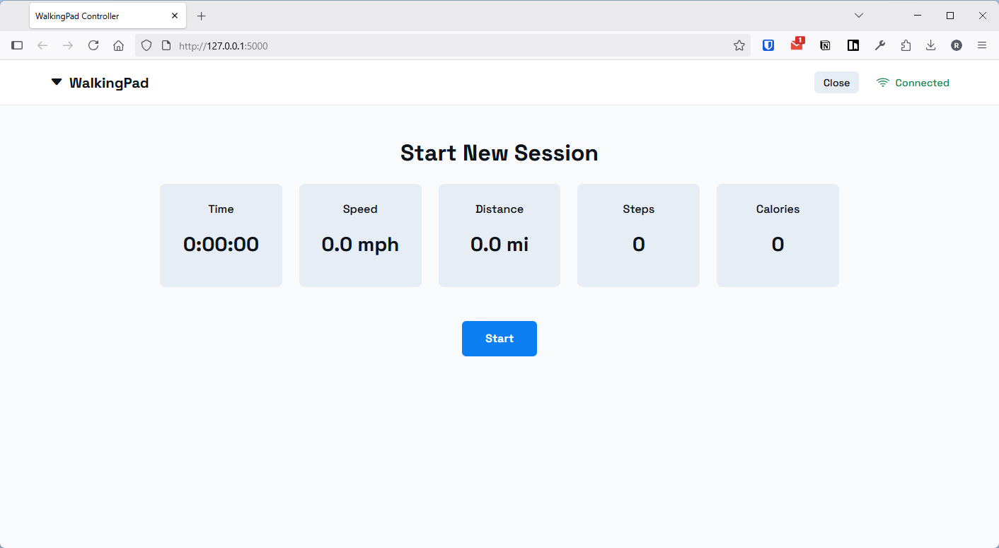
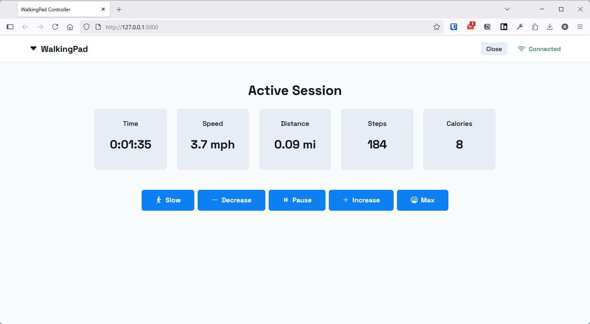
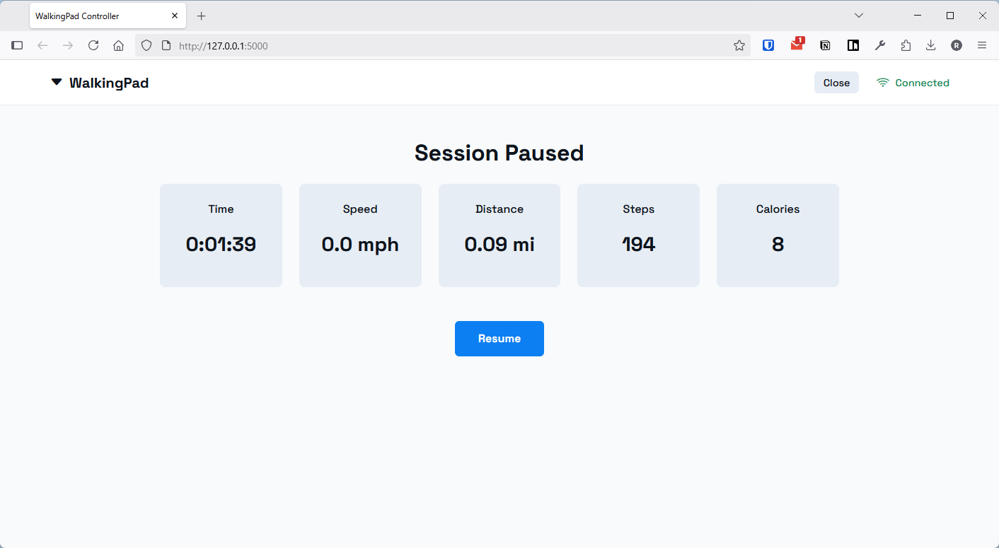

# WalkingPad Web Controller

A simple, web-based application to control your KingSmith WalkingPad treadmill via Bluetooth Low Energy (BLE), offering features and a user experience that aims to improve upon the official app and remote.  

This project was born out of a desire for a more flexible WalkingPad experience, specifically to address the limitations of the official controls, such as the inability to truly pause and resume a session (especially after stepping off) and the lack of cumulative session stat tracking across these pauses. With this application, you can easily hop off your WalkingPad, or pause it via the app/remote, and then seamlessly continue your session, tracking your total progress.

This application was built for my own needs, but can be easily adapted for your own needs, for example, if you need metric instead of imperial measurements.  

## Key Features

* **Web-Based Interface:** Control your WalkingPad from any device on your local network using a web browser.
* **Bluetooth LE Connection:** Directly connects to and controls your WalkingPad.
* **Full Session Control:**
    * Start new walking sessions.
    * Pause sessions via the app.
    * Resume sessions at the last used speed.
* **Intelligent Auto-Pause & Resume:**
    * Automatically detects if you've stepped off the WalkingPad or if it's stopped by the remote, and transitions the app to a paused state.
    * Resumes from these auto-pauses at a stable speed from before the interruption.
* **Dynamic Stat Tracking:** Displays and updates live session data:
    * Current Speed (mph)
    * Cumulative Distance (miles)
    * Cumulative Steps
    * Estimated Calories Burned
    * Cumulative Active Time (H:M:S format)
* **Precise Speed Adjustments:**
    * Increase/Decrease speed buttons.
    * "Max Speed" preset button (defaults to ~3.7 MPH / 6.0 km/h, configurable).
    * "Slow Walk" preset button (defaults to ~2.8 MPH / 4.5 km/h, configurable).
* **User-Friendly Conveniences:**
    * Application automatically opens in your default web browser on startup (Windows).
    * Includes a batch script for easy launching via a desktop/taskbar shortcut on Windows, including virtual environment activation.
    * Clean, modern user interface.
    * Connection status always visible in the header.
    * "Close" button in the app to cleanly shut down the server.
    * **Keyboard Shortcuts:** Global keyboard shortcuts for quick control:
        * **Spacebar**: Start a new session, pause a running session, or resume a paused session
        * **+ (Plus/Equal key)**: Increase walking speed (only when belt is running)
        * **- (Minus key)**: Decrease walking speed (only when belt is running)
* **Cross-Platform Server:** Runs on Windows, macOS, or Linux systems that have Python and a Bluetooth adapter.

## Screenshots

Below are some representative screenshots of the application in action:

### Start Session Screen
This is the initial screen you see after connecting to the WalkingPad, before a session has begun.


### Active Session Screen
Displays live stats while you are actively walking. Includes controls for speed and pausing.


### Paused Session Screen
Shown when a session is paused, either manually or automatically. Displays cumulative stats and allows you to resume.


## Supported Models

This application is known to work with the **WalkingPad C1** model.
It *should* also work with other WalkingPad models supported by the underlying `ph4-walkingpad` Python library, such as A1 and R1 PRO. Compatibility may vary depending on the specific model and firmware.

## Credit & Core Dependency

This application relies heavily on the excellent **`ph4-walkingpad`** Python library created by **ph4x** for Bluetooth communication and control of the WalkingPad. This project would not be possible without their work in reverse-engineering the protocol and providing the control interface.

* **ph4-walkingpad on PyPI:** [https://pypi.org/project/ph4-walkingpad/](https://pypi.org/project/ph4-walkingpad/)
* **ph4-walkingpad on GitHub:** (You might want to find and add the GitHub link if you know it)

## Prerequisites

* Python 3.8 or newer.
* A Bluetooth adapter on the computer running this application.
* A compatible WalkingPad treadmill.
* The `pip` package installer for Python.

## Setup and Installation

1.  **Clone the Repository (or download files):**
    ```bash
    # If you have git installed:
    # git clone <your-repository-url>
    # cd <repository-name>
    # Otherwise, download the files and navigate to the directory.
    ```

2.  **Create a Python Virtual Environment:**
    (Recommended to keep dependencies isolated)
    Open a terminal or command prompt in the project directory:
    ```bash
    python -m venv venv
    ```

3.  **Activate the Virtual Environment:**
    * On Windows:
        ```cmd
        venv\Scripts\activate
        ```
    * On macOS/Linux:
        ```bash
        source venv/bin/activate
        ```
    You should see `(venv)` at the beginning of your command prompt.

4.  **Install Dependencies:**
    With the virtual environment activated, install the required Python packages:
    ```bash
    pip install -r requirements.txt
    ```
    The `requirements.txt` file should contain:
    ```
    flask
    bleak
    ph4-walkingpad
    waitress
    ```

## Running the Application

This application uses the `waitress` WSGI server for a more stable experience than Flask's built-in development server.

1.  Ensure your WalkingPad is powered on and discoverable via Bluetooth.
2.  Make sure your virtual environment is activated (see Step 3 above if it's not).
3.  Run the application using the provided `run.py` script:
    ```bash
    python run.py
    ```
4.  The script will start the `waitress` server and automatically open the application in your default web browser at `http://127.0.0.1:5000`.
5.  The console window running `run.py` will display logs from the application. You can stop the server by pressing `Ctrl+C` in this window, or by using the "Close" button in the web application's header.

**For easy launching on Windows:**
A `start_app.bat` script is provided to automate VENV activation and running `run.py`. You can create a desktop shortcut pointing to this `.bat` file and configure the shortcut to run minimized. (Refer to previous instructions on how to do this).

## How to Use

1.  **Connection:**
    * When the app starts, it will attempt to scan for and connect to your WalkingPad.
    * The header displays the connection status ("Connecting...", "Connected", "Disconnected").
    * If disconnected, a "Connect" or "Try Again" button will be available.

2.  **Starting a Session:**
    * Once connected, if no session is active, you'll see the "Start New Session" screen.
    * Stat cards will show initial values (0 distance, 0 steps, 0:00:00 time, etc.).
    * Click the "Start" button to begin your workout.

3.  **Active Session:**
    * The "Active Session" screen will appear.
    * Stat cards (Time, Speed, Distance, Steps, Calories) will update dynamically.
    * Control buttons are available:
        * **Slow:** Sets speed to a predefined slow walk (~2.8 MPH).
        * **Decrease:** Lowers speed by a small step.
        * **Pause:** Pauses the session and stops the belt.
        * **Increase:** Raises speed by a small step.
        * **Max:** Sets speed to the maximum configured (~3.7 MPH).
    * **Keyboard Shortcuts:** You can also control the session using keyboard shortcuts:
        * **Spacebar:** Start a new session (same as clicking "Start"), pause a running session (same as clicking "Pause"), or resume a paused session (same as clicking "Resume")
        * **+ (Plus/Equal key):** Increase speed (same as clicking "Increase") - only works when belt is running
        * **- (Minus key):** Decrease speed (same as clicking "Decrease") - only works when belt is running
        * These shortcuts work on any page and provide visual feedback when used
    * If you step off the pad or stop it via the remote, the app will detect this and automatically switch to the "Paused Session" screen.

4.  **Paused Session:**
    * The "Paused Session" screen shows your current cumulative stats.
    * A "Resume" button is available to continue your session at the speed you were at before pausing.

5.  **Ending the Application:**
    * Click the "Close" button in the header of the web interface. This will shut down the Python server application.

## Customization

Some speed settings can be configured directly in `app.py`.  All speeds are set in KPH:
* `MAX_SPEED_KMH`: Default maximum speed for the "Max" button.
* `MIN_SPEED_KMH`: Minimum speed the pad will be set to.
* `SPEED_STEP`: How much the speed changes with "Increase"/"Decrease" buttons.
* `SLOW_WALK_SPEED_KMH`: The target speed for the "Slow" button.

## Troubleshooting

* **Connection Issues:**
    * Ensure your computer's Bluetooth is turned on.
    * Make sure your WalkingPad is powered on and not connected to another device (like your phone's official app).
    * Try moving the WalkingPad or your computer closer to improve signal strength.
    * Check the console window (where you ran `python run.py`) for error messages or detailed logs.
* **Icons Not Displaying:**
    * This application uses Bootstrap Icons loaded from a CDN. Ensure the computer running the browser has an internet connection. The link is `https://cdn.jsdelivr.net/npm/bootstrap-icons@1.11.3/font/bootstrap-icons.css`. If specific icons like `bi-turtle` or `bi-rabbit` are missing, the CDN version might be older than the version where those icons were introduced. Consider updating the version in the link in `base.html`.
* **App Behavior:**
    * If the app behaves unexpectedly, review the console logs for errors from Python (Flask/Waitress server) or the browser's developer console for JavaScript errors.